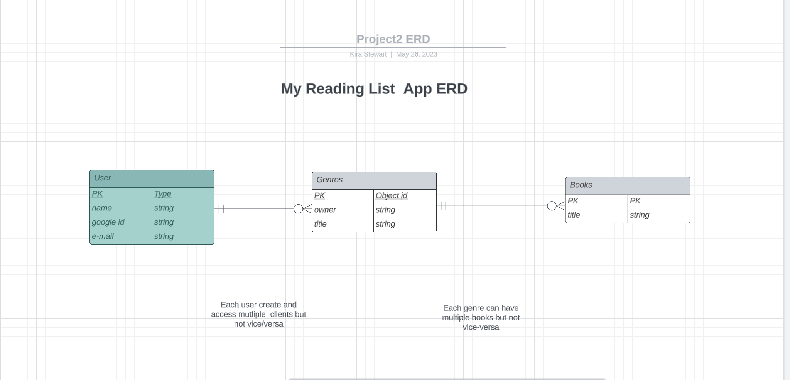
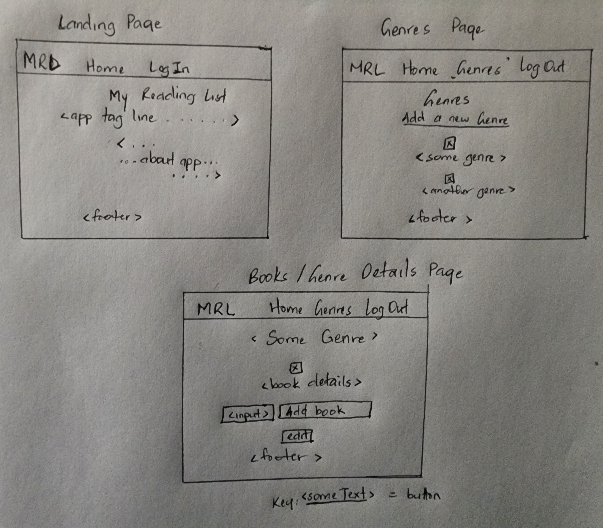
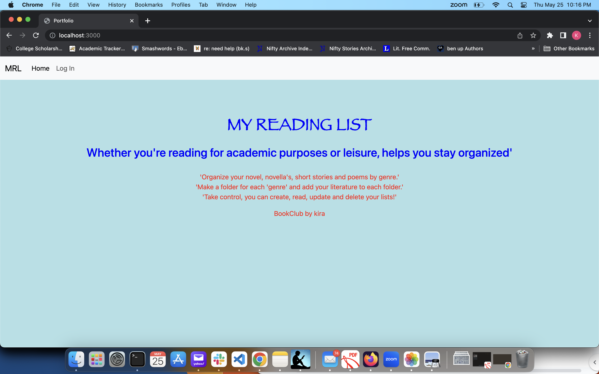
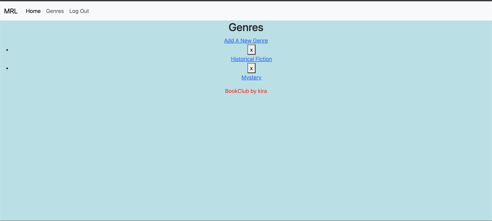
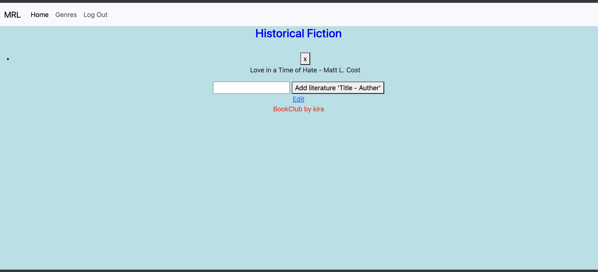
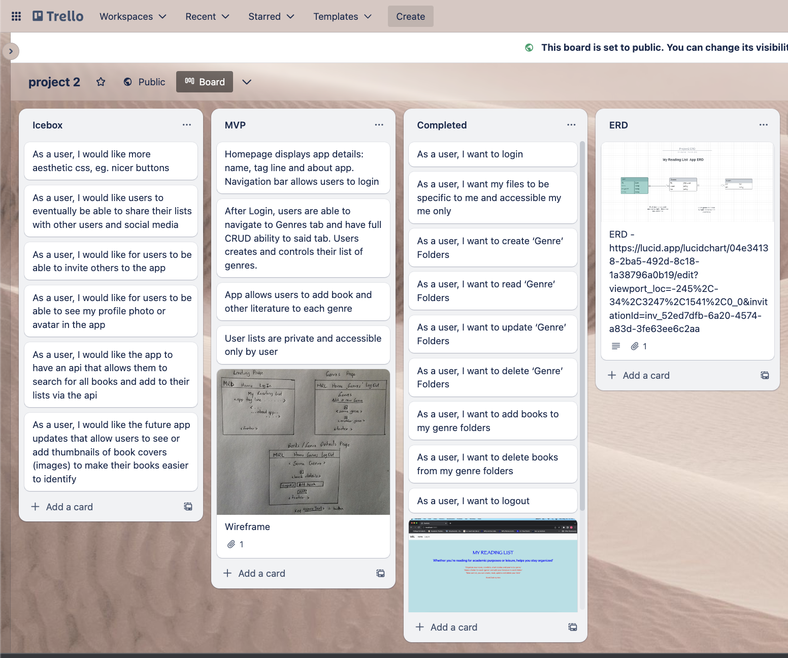

# Project 2 App - 'My Reading List'

## About App
    My Reading List is a way to create and sort books in which they are interested, whether these are mandatory readings for scholastic purposes or leisure readings. Users are able to login(out) to create private book lists, sorted into genres. It employs a clean and intuitive design, without unnessecary embelishment.

## User Guide
    To utilize the app, users must navigate to the link above and login with their google account. After that, they can create Genre folders by navigating to the genre page and using the ‘Add Genre’ button. A user is also able to edit the names of their genres. Just as easily, a user can click into these private genre folders for details on individual folders and to add new literature titles. User lists are private.

## Technologies Used
- MongoDB
- Express
- Javascript
- CSS
- HTML
- Fly.io
- Node

## ERD

## Wireframe

## Screenshots

### Home page

### List of Genres

### List of Books in Genre

## Getting Started

## Trello Board
    Use this link to view: https://trello.com/b/ak3buciT/project-2

## Link to My Reading List App
Use this link to access https://mrl.fly.dev/

## User Stories
- As a user, I want to login
- As a user, I want my files to be specific to me and accessible my me only
- As a user, I want to create ‘Genre’ Folders
- As a user, I want to read ‘Genre’ Folders
- As a user, I want to update ‘Genre’ Folders
- As a user, I want to delete ‘Genre’ Folders
- As a user, I want to add books to my genre folders
- As a user, I want to delete books from my genre folders
- As a user, I want to logout

## Icebox
- As a user, I would like more aesthetic css, eg. nicer buttons
- As a user, I would like users to eventually be able to share their lists with other users and social media
- As a user, I would like for users to be able to invite others to the app
- As a user, I would like for users to be able to add a profile photo or avatar
- As a user, I would like the app to have an api that allows them to search for all books and add to their lists via the api
- As a user, I would like the future app updates that allow users to see or add thumbnails of book covers (images) to make their books easier to identify
